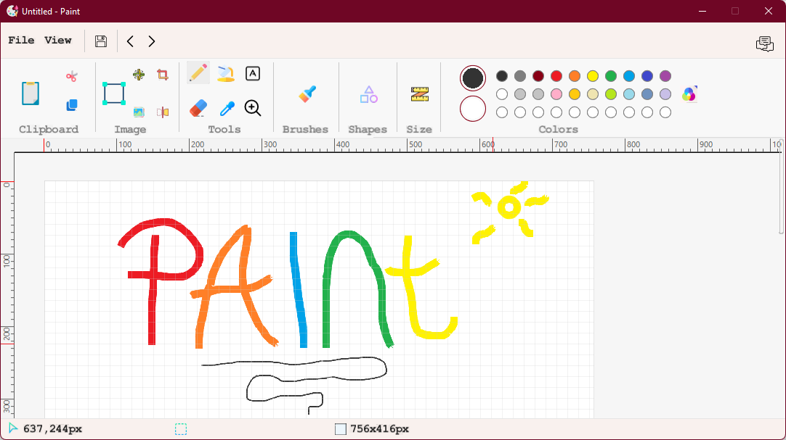

# Paint Clone
A simple reproduction of the Windows Paint application, made with the graphics library **Slick2D**.

**Slick2D** is a library for making 2D RPG games 😅.

Apart from that, the particularity of this example lies in features such as scroll, back/forward (ctrl + z / ctrl + y), and many other shortcuts.

