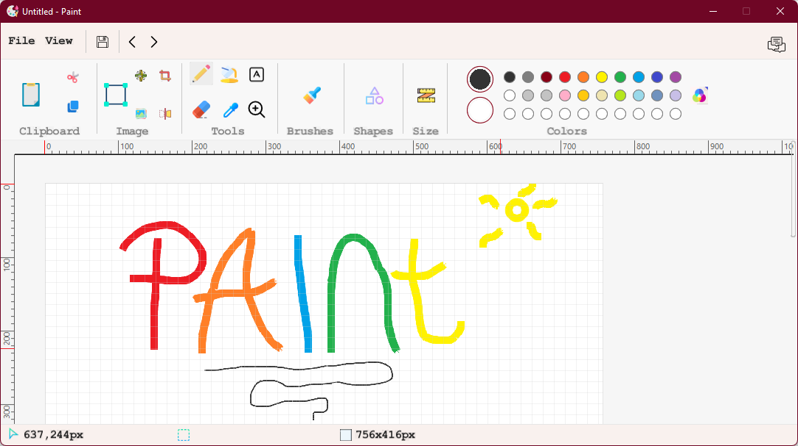

  <h1 align="center">
        Paint Clone
    
  </h1>

  <h3 align="center">A reproduction of the windows paint application.</h3>

 

 
## Features ✨

* Of course drawing! **Drawing custom shapes** ✍ (*with the pencil or the brush*)
* Classic shapes such as **rectangles, circles, curves and others are implemented**
* And if you made a mistake you can **erase** it
* You can also **write text**  
* **Resize your brush** 📏
* **Scroll** the drawing space
* You can **choose the colour** 🎨 from the samples offered, or **create your own** (*with the colour picker*)
* **Shortcuts** such as `ctrl+z`, `ctrl+y` (to move backwards or forwards), and other shortcuts defined in the original Paint are implemented

 
## How To build 🔨

Since Slick2D requires OS dependent native libraries, you cannot just export an executable -jar in order to to run the game on your system outside your IDE. At the moment, the application has no executable file. So you need to copy my source code on your IDE for launch the app.

 
## Toolkit 🧰

* [JDK v.1.8.0_65](http://www.oracle.com/technetwork/java/javase/downloads/jdk8-downloads-2133151.html) - Java Development Kit. What else can I say?

* [Eclipse IDE](https://www.eclipse.org) 
 Maybe the most famous IDE for Java developers. 

* [Slick2D](https://slick.ninjacave.com/javadoc/) - An easy to use set of tools and utilites wrapped around LWJGL OpenGL bindings to make 2D Java game development easier. See the documentation for more information. 
